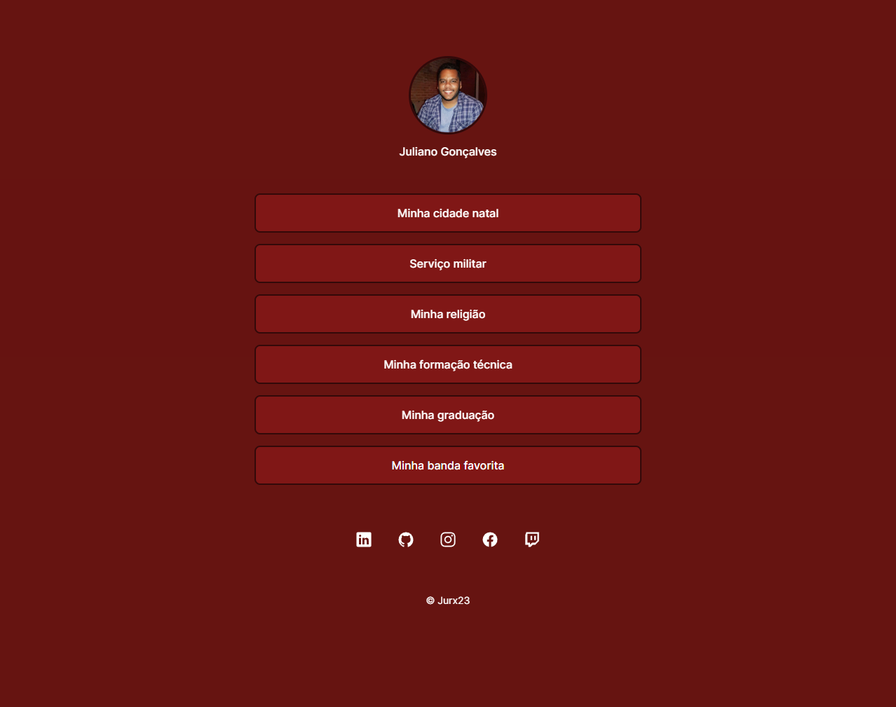

<h1 align="center"> DevLinks </h1>

Projeto desenvolvido em parceria com a 
<a href="https://lp.rocketseat.com.br/devlinks/inscricao?utm_source=github&utm_medium=descricao&utm_campaign=capture-devlinks&utm_term=organic&utm_content=descricao-github-mayk-brito">Rocketseat</a>

  <a href="#-projeto">Projeto</a>&nbsp;&nbsp;&nbsp;|&nbsp;&nbsp;&nbsp;
  <a href="#-tecnologias">Tecnologias</a>&nbsp;&nbsp;&nbsp;|&nbsp;&nbsp;&nbsp;
  <a href="#memo-licença">Licença</a>

  

## 💻 Projeto

O DevLinks é um agregador de links para usar como cartão de visitas online.

- [Acesse o projeto finalizado, online](https://jurx23.github.io/devlinks)

## 🚀 Tecnologias

Esse projeto foi desenvolvido com as seguintes tecnologias e ferramentas:

- HTML 5
- CSS 3
- Git
- Github
- Visual Studio Code
- Adobe Color

## 📝 Licença

Esse projeto está sob a licença MIT.

  

